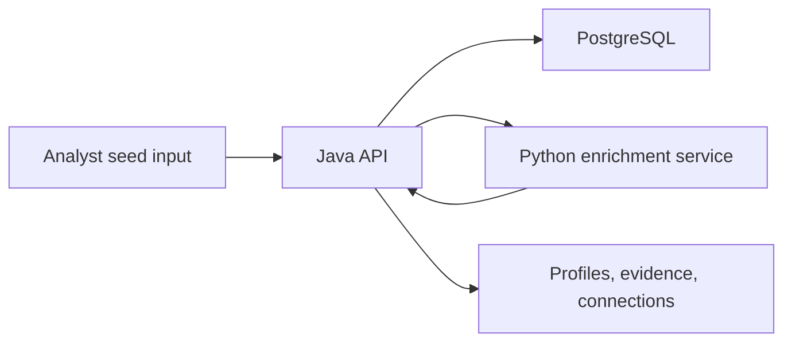

# OSINT Profile Correlator

A small, auditable OSINT case-management tool built with:

- Java 21 for the HTTP API
- Python 3 for lightweight enrichment from a single seed input
- PostgreSQL for profiles, identifiers, evidence, searches, relationships, and OSINT source catalog entries

This project is designed for lawful, public-source investigations where every claim is tied to evidence. It does not bypass access controls, scrape private systems, or infer sensitive facts without a recorded source.

## Architecture



## Requirements

- Java 21
- Python 3.10+
- PostgreSQL 14+
- PostgreSQL JDBC driver jar, for example `postgresql-42.x.x.jar`

Maven is intentionally not required.

## Database Setup

Create a PostgreSQL database and run:

```powershell
psql -d osint -f database/schema.sql
```

After pulling updates, run the same schema command again to add new tables/indexes (for example `profile_correlation_keys` used by auto-correlation).

Optionally import the OSINT Framework tool catalog:

```powershell
python tools/import_osint_framework.py --output database/osint_framework_import.sql
psql -d osint -f database/osint_framework_import.sql
```

Copy the environment sample:

```powershell
Copy-Item .env.example .env
```

Set these environment variables before starting the Java API:

```powershell
$env:OSINT_DB_URL="jdbc:postgresql://localhost:5432/osint"
$env:OSINT_DB_USER="postgres"
$env:OSINT_DB_PASSWORD="postgres"
$env:OSINT_ENRICHER_URL="http://127.0.0.1:8091/enrich"
```

## Run

Start everything and open the browser app from one PowerShell window:

```powershell
powershell -ExecutionPolicy Bypass -File "C:\Users\user\Documents\New project\scripts\start-all.ps1" -DbPassword "your_postgres_password"
```

Enable external connectors in the same one-window startup (Holehe, Sherlock, Social Analyzer, Maigret, PhoneInfoga, theHarvester, Amass, GHunt, SpiderFoot API):

```powershell
powershell -ExecutionPolicy Bypass -File "C:\Users\user\Documents\New project\scripts\start-all.ps1" `
  -DbPassword "your_postgres_password" `
  -EnableSherlock `
  -EnableSocialAnalyzer `
  -EnableMaigret `
  -EnablePhoneInfoga `
  -EnableTheHarvester `
  -EnableAmass `
  -EnableGHunt `
  -EnableHolehe `
  -EnableSpiderFoot `
  -SpiderFootBaseUrl "http://127.0.0.1:5001" `
  -ConnectorTimeoutSec 25
```

The page opens at:

```text
http://127.0.0.1:8080/
```

Keep that PowerShell window open while using the app. Press Enter in that window to stop both services.

The browser app lets you create profiles, inspect all collected profiles/evidence/identifiers/connections in PostgreSQL, search the OSINT Framework catalog, and export collected profile data as JSON.

Each new profile also receives automatic category coverage entries:
- one queued entry per OSINT Framework category currently loaded in `osint_tools`
- plus queued tool entries (top 3 tools per category) so every category has concrete tool pivots attached to the profile

Start the Python enrichment service:

```powershell
powershell -ExecutionPolicy Bypass -File .\scripts\start-enricher.ps1
```

## Project Checkup

Run a full local validation pass (Java compile + Python syntax + frontend syntax + log scan):

```powershell
powershell -ExecutionPolicy Bypass -File .\scripts\checkup.ps1
```

Run the same checks plus live HTTP probes:

```powershell
powershell -ExecutionPolicy Bypass -File .\scripts\checkup.ps1 -RequireHttp
```

Notes:
- `-ProbeHttp` checks endpoints but records warnings if unavailable.
- `-RequireHttp` checks endpoints and fails if unavailable.
- Endpoint probes target `/health`, `/`, and `/assets/app.js` at `http://127.0.0.1:8080` by default.
- Log failures are based on a recent window (`-LogLookbackMinutes`, default `30`). Historical errors outside that window are reported as warnings, not hard failures.

## CircleCI (CircleCI-Only CI)

This repository includes `.circleci/config.yml` with four jobs:

- `backend_build`: Java compile
- `python_check`: `py_compile` for enricher modules
- `frontend_check`: `node --check` for frontend script
- `smoke_http`: self-contained runtime smoke (conditional)

Default workflow runs:
- `backend_build`
- `python_check`
- `frontend_check`

Conditional workflow:
- `smoke_http` runs only when pipeline parameter `run_smoke_http=true`.

When `run_smoke_http=true`, CircleCI now starts PostgreSQL + enricher + API inside CI, applies `database/schema.sql`, waits for `/health`, and then asserts HTTP 200 for `/health`, `/`, and `/assets/app.js`.

## External Tool Setup (Optional)

Install Sherlock:

```powershell
python -m pip install sherlock-project
```

Install Social Analyzer:

```powershell
python -m pip install social-analyzer
```

Install Maigret:

```powershell
python -m pip install maigret
```

Install PhoneInfoga (binary or Docker, per upstream docs):

- [PhoneInfoga usage docs](https://sundowndev.github.io/phoneinfoga/getting-started/usage/)
- Basic CLI usage after install: `phoneinfoga scan -n "+1 555 444 3333"`

Install theHarvester:

```powershell
python -m pip install theHarvester
```

Install Amass:

- Download a release or use package manager:
  [OWASP Amass releases](https://github.com/owasp-amass/amass/releases)
- Basic CLI usage after install: `amass enum -passive -d example.com`

Install GHunt:

```powershell
python -m pip install ghunt
```

GHunt needs a one-time authenticated login before email lookups:

```powershell
ghunt login
```

Install Holehe:

```powershell
python -m pip install holehe
```

Run SpiderFoot server (in a separate terminal):

```powershell
git clone https://github.com/smicallef/spiderfoot.git
cd spiderfoot
python -m pip install -r requirements.txt
python .\sf.py -l 127.0.0.1:5001
```

Then start this project with `-EnableSpiderFoot` and `-SpiderFootBaseUrl "http://127.0.0.1:5001"`.

To enable the external connectors when running only the enricher:

```powershell
powershell -ExecutionPolicy Bypass -File .\scripts\start-enricher.ps1 `
  -EnableSherlock `
  -EnableSocialAnalyzer `
  -EnableMaigret `
  -EnablePhoneInfoga `
  -EnableTheHarvester `
  -EnableAmass `
  -EnableGHunt `
  -EnableHolehe `
  -EnableSpiderFoot `
  -SpiderFootBaseUrl "http://127.0.0.1:5001" `
  -ConnectorTimeoutSec 25
```

If a connector executable is not in PATH, pass explicit command overrides:

```powershell
powershell -ExecutionPolicy Bypass -File .\scripts\start-all.ps1 `
  -DbPassword "your_postgres_password" `
  -EnableHolehe `
  -HoleheCmd "C:\tools\holehe.exe" `
  -EnablePhoneInfoga `
  -PhoneInfogaCmd "C:\tools\phoneinfoga.exe" `
  -EnableAmass `
  -AmassCmd "C:\tools\amass.exe"
```

Run the Java API:

```powershell
powershell -ExecutionPolicy Bypass -File .\scripts\start-api.ps1 -DbPassword "your_postgres_password"
```

If your PostgreSQL JDBC jar is somewhere else, pass it explicitly:

```powershell
powershell -ExecutionPolicy Bypass -File .\scripts\start-api.ps1 `
  -DbPassword "your_postgres_password" `
  -JdbcJar "C:\path\to\postgresql-42.x.x.jar"
```

## API

Create a profile from a single input:

```powershell
Invoke-RestMethod -Method Post -Uri http://127.0.0.1:8080/api/profiles `
  -ContentType "application/json" `
  -Body '{"seed":"alice@example.com"}'
```

Get a profile:

```powershell
Invoke-RestMethod http://127.0.0.1:8080/api/profiles/{profileId}
```

Add a manual connection:

```powershell
Invoke-RestMethod -Method Post -Uri http://127.0.0.1:8080/api/connections `
  -ContentType "application/json" `
  -Body '{"fromProfileId":"...","toProfileId":"...","relationshipType":"same_organization","confidence":0.65,"source":"manual review"}'
```

Search imported OSINT Framework tools:

```powershell
Invoke-RestMethod "http://127.0.0.1:8080/api/tools?input=email&opsec=passive&limit=25"
```

Useful filters:

- `input`: input type or category text, such as `username`, `email`, `domain`, `phone`, or `image`
- `q`: free-text search over name, URL, description, and category path
- `opsec`: `passive` or `active`
- `api`: `true` or `false`
- `registration`: `true` or `false`
- `localInstall`: `true` or `false`
- `googleDork`: `true` or `false`
- `deprecated`: `true` or `false`
- `limit`: max rows, capped at `200`

## OSINT Framework Usage

This project uses OSINT Framework as an attributed catalog source, not as a blanket instruction to query every listed service. The importer reads the public `arf.json` data from the upstream repository, preserves metadata such as required registration, local install, Google dork/manual URL markers, API availability, OPSEC mode, status, pricing, and license source, then stores it in `osint_tools`.

The app can use the catalog to recommend or find sources for a seed input. Connectors should still be added deliberately in `services/enricher/connectors.py`, with respect for each service's terms, rate limits, and legal/ethical limits.

## Notes

- Confidence scores are hints, not truth.
- Evidence URLs and text should be public, lawful, and relevant.
- External connector integrations are optional and off by default. Enable only the tools you installed (`-EnableHolehe`, `-EnableSherlock`, `-EnableSocialAnalyzer`, `-EnableMaigret`, `-EnablePhoneInfoga`, `-EnableTheHarvester`, `-EnableAmass`, `-EnableGHunt`, `-EnableSpiderFoot`).
- `Holehe`, `Sherlock`, `Social Analyzer`, `Maigret`, `PhoneInfoga`, `theHarvester`, `Amass`, and `GHunt` run locally from your environment. `SpiderFoot` integration uses the local SpiderFoot API (`/startscan`, `/scanstatus`, `/scaneventresults`) and expects a running SpiderFoot server.
- Holehe runs first when enabled and checks email existence scope for the primary seed email plus at most one additional extracted email by default.
- Auto-correlation persists internal keys (`email`, `username`, `domain`) and creates deduplicated `shared_email` / `shared_username` connections with source `auto-correlation`. Domain-only overlaps are stored as evidence without connection edges.
- The `Identifiers` tab now stores only link-style identifiers: direct seed URLs and verified profile URLs that passed live checks.
- Connector URL hits are auto-validated before being accepted (HTTP reachable, redirect followed, and profile-like path checks).
- Connector execution limits are configurable with:
  - `OSINT_CONNECTOR_TIMEOUT_SEC`
  - `OSINT_HOLEHE_MAX_EMAILS`
  - `OSINT_HOLEHE_TIMEOUT_SEC`
  - `OSINT_HOLEHE_CMD`
  - `OSINT_URL_CHECK_TIMEOUT_SEC`
  - `OSINT_MAIGRET_TOP_SITES`
  - `OSINT_THEHARVESTER_SOURCE`
  - `OSINT_THEHARVESTER_LIMIT`
  - `OSINT_AMASS_TIMEOUT_SEC`
  - `OSINT_SPIDERFOOT_BASE_URL`
  - `OSINT_SPIDERFOOT_SCAN_TIMEOUT_SEC`
  - `OSINT_SPIDERFOOT_MAX_EVENTS`
- The Python service extracts obvious emails, URLs, domains, handles, phone-like tokens, IP addresses, hashtags, and common crypto addresses. It also creates low-confidence derived candidates such as email local-parts, username candidates, provider domains, root domains, TLDs, subdomains, URL paths, phone digits, IP scope, reverse-DNS candidates, name candidates, and keyword tokens.
- Username-like seeds also create unconfirmed account URL candidates for GitHub, Instagram, Facebook, and LinkedIn. These links are review pivots, not proof that the account belongs to the subject.
- The Searches tab includes suggested pivots such as exact email lookup, username lookup, and site-specific query ideas. These are not automatically sent to third parties.
- You can add source-specific public connectors in `services/enricher/connectors.py`; make sure each connector respects the source's terms, rate limits, and privacy boundaries.

## Browser UX Regression Checklist

When Browser plugin tools are unavailable, run this checklist manually in the local browser:

1. Desktop and mobile viewport checks:
   - verify layout for intake, profiles, detail, and OSINT tools panels
   - verify table scrolling and sticky headers in detail tabs
2. Core flow checks:
   - create profile from seed
   - filter profiles
   - switch tabs (`Finds`, `Evidence`, `Searches`, `Coverage`, `Connections`)
3. OSINT tools panel checks:
   - search by input keyword
   - filter by OPSEC
   - verify tool links and metadata badges render
4. Interaction checks:
   - toggle theme
   - trigger JSON export
5. Empty/error checks:
   - no-profile state
   - no-tool-match state
   - backend unavailable message
   - large-table truncation notice (`Showing X of Y rows`)

## GitHub Sharing

This repository is safe to share after you review your local data:

- Do not commit `.env`, `logs/`, `out/`, or database exports.
- Do not commit PostgreSQL passwords or investigation exports.
- Regenerate `database/osint_framework_import.sql` locally with `tools/import_osint_framework.py`; it is ignored by Git because it is generated third-party catalog data.
- The app stores collected investigation data in PostgreSQL, not in the source tree.
