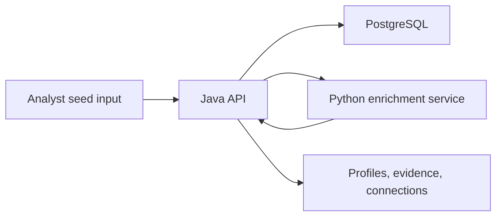

# Bad OSINT

Bad OSINT is a local-first OSINT workbench: give it a seed (email, username, or phone number), let it run a set of optional local tools, and store what it finds in PostgreSQL so you can review and correlate it later.

It is built to be auditable. The goal is not "guesses"; it is traceability. When the app records something, it should be tied to evidence, tool output, and timestamps.

Scope and intent: lawful, public-source investigations. Do not use this to bypass access controls or to target people.

## Architecture



## Requirements

- Java 21
- Python 3.10+ (Windows: Python 3.12 is recommended for tool installs)
- PostgreSQL 14+
- PostgreSQL JDBC driver JAR (example: `postgresql-42.x.x.jar`)

Maven is intentionally not required.

## Database Setup

Create a PostgreSQL database and run:

```powershell
psql -d osint -f database/schema.sql
```

After pulling updates, re-run the schema to pick up new tables/indexes.

Optionally import the OSINT Framework tool catalog:

```powershell
python tools/import_osint_framework.py --output database/osint_framework_import.sql
psql -d osint -f database/osint_framework_import.sql
```

Copy the environment sample:

```powershell
Copy-Item .env.example .env
```

Set these environment variables (or rely on the startup scripts):

```powershell
$env:OSINT_DB_URL="jdbc:postgresql://localhost:5432/osint"
$env:OSINT_DB_USER="postgres"
$env:OSINT_DB_PASSWORD="postgres"
$env:OSINT_ENRICHER_URL="http://127.0.0.1:8091/enrich"
```

## Quick Start (Windows)

This repo is Windows-first right now (PowerShell + CMD). Non-Windows support is possible, but the bootstrap scripts and tool installers are written for Windows.

1. Install the project-local tools:

```powershell
powershell -ExecutionPolicy Bypass -File .\install.badosint.ps1
```

From CMD:

```cmd
install.badosint.cmd
```

This creates:

- `.venv/` (project Python venv)
- `.tools/` (checked-out tools and per-tool venvs/binaries)
- `.badosint.local.env` (local-only config, ignored by git)

2. Start everything and open the UI:

```powershell
powershell -ExecutionPolicy Bypass -File .\start.badosint.ps1
```

From CMD:

```cmd
start.badosint.cmd
```

The UI opens at:

```text
http://127.0.0.1:8080/
```

Keep the startup window open while you use the app. Press Enter in that window to stop services.

If `-DbPassword` is not provided and `OSINT_DB_PASSWORD` is not set, startup asks for the local PostgreSQL password.

### PowerShell ExecutionPolicy Note

If you see "running scripts is disabled on this system", do not run `.\start.badosint.ps1` directly. Use:

```powershell
powershell -ExecutionPolicy Bypass -File .\start.badosint.ps1
```

That does not permanently change your machine policy; it applies only to that invocation.

## Help

All launchers support help flags and exit without starting anything:

```powershell
powershell -ExecutionPolicy Bypass -File .\start.badosint.ps1 -h
```

```cmd
start.badosint.cmd /?
```

## Tool Installer

Install all supported tools:

```powershell
powershell -ExecutionPolicy Bypass -File .\install.badosint.ps1
```

Install only selected tools:

```powershell
powershell -ExecutionPolicy Bypass -File .\install.badosint.ps1 -Tools holehe,sherlock,ghunt
```

Skip selected tools:

```powershell
powershell -ExecutionPolicy Bypass -File .\install.badosint.ps1 -SkipTools cobalt,spiderfoot
```

CMD equivalents:

```cmd
install.badosint.cmd
install.badosint.cmd -Tools holehe,sherlock,ghunt
install.badosint.cmd -SkipTools cobalt,spiderfoot
```

The installer prompts before optional interactive steps (notably GHunt login and an optional Cobalt Docker image pull). It writes command paths into `.badosint.local.env`, and `start.badosint` reads that file automatically.

On Windows, the installer prefers python.org Python 3.12 for local virtual environments. If it cannot find a usable 3.12, it can download a project-local Python into `.tools\\python312`. Python 3.13 is avoided for SpiderFoot because `lxml<5` can fall back to a source build on Windows (which usually means "install Visual Studio build tooling and libxml2 headers", which most users do not want).

## Default Tools

Startup attempts to enable all supported external tools by default:

- `holehe`
- `sherlock`
- `social-analyzer`
- `maigret`
- `phoneinfoga`
- `theharvester`
- `amass`
- `ghunt`
- `spiderfoot`

If a tool is missing/unreachable, startup lists it and asks whether to continue without it for that run.

## Disable Tools

Disable selected tools from PowerShell:

```powershell
powershell -ExecutionPolicy Bypass -File .\start.badosint.ps1 -DisableTools ghunt,amass
```

Disable selected tools from CMD:

```cmd
start.badosint.cmd -DisableTools ghunt,amass
```

## Advanced Startup

The root launchers call the advanced script below. Use it directly for custom parameters:

```powershell
powershell -ExecutionPolicy Bypass -File .\scripts\start-all.ps1 -DisableTools ghunt,amass
```

The root launchers pass `-StopExisting` and `-AutoPort`.

- `-StopExisting` stops stale Bad OSINT Java/Python processes before binding ports.
- `-AutoPort` picks another free port if `8080` is blocked by something Windows will not let the script stop.

You can also use these flags directly:

```powershell
powershell -ExecutionPolicy Bypass -File .\scripts\start-all.ps1 -StopExisting
powershell -ExecutionPolicy Bypass -File .\scripts\start-all.ps1 -AutoPort
```

## Checkup

Run a local "is the repo healthy?" check:

```powershell
powershell -ExecutionPolicy Bypass -File .\scripts\checkup.ps1
```

Startup logs are written to `logs\\api.out.log`, `logs\\api.err.log`, `logs\\enricher.out.log`, and `logs\\enricher.err.log`.

## External Repos Used

Bad OSINT wraps (and tries to install) these upstream tools. Follow each project's license, acceptable-use guidance, and rate limits:

- Holehe: https://github.com/megadose/holehe
- Sherlock: https://github.com/sherlock-project/sherlock
- Social Analyzer: https://github.com/qeeqbox/social-analyzer
- Maigret: https://github.com/soxoj/maigret
- PhoneInfoga: https://github.com/sundowndev/phoneinfoga
- theHarvester: https://github.com/laramies/theHarvester
- Amass: https://github.com/owasp-amass/amass
- GHunt: https://github.com/mxrch/GHunt
- SpiderFoot: https://github.com/smicallef/spiderfoot

### Planned (Media Support)

- Cobalt: https://github.com/imputnet/cobalt

## Tool Notes (Windows Reality Check)

Bad OSINT tries hard to make tool setup one command, but upstream projects have their own dependencies and release quirks. A few practical notes:

- SpiderFoot: on Windows, SpiderFoot can fail to install in a fresh venv if `lxml` falls back to a source build. If that happens, use Python 3.12 (not 3.13) and prefer wheels. If you already have a working SpiderFoot installation, you can point Bad OSINT at it instead of installing a new one.
- Amass: Amass is a Go binary. If the installer cannot find a matching Windows release asset for your platform, you can install Amass yourself and set the command path in `.badosint.local.env`.
- GHunt: GHunt setup includes an interactive login step. The installer can launch it, but the session is yours, and the credentials stay on your machine (do not commit them).

## What The UI Shows

- Finds: positive, verified link findings for the seed (and derived identifiers where applicable)
- Evidence: raw tool output, notes, and correlation breadcrumbs
- Searches: suggested pivots and queries (these are not automatically sent to third parties)
- Coverage: which OSINT Framework categories/tools were considered/queued
- Connections: automatic links created from strict matches (shared email, shared username)

## OSINT Framework Usage

This project uses OSINT Framework as an attributed catalog source, not as a blanket instruction to query every listed service. The importer reads the public `arf.json` metadata and stores it in `osint_tools` so the UI can act like a searchable toolbox reference.

Treat the catalog as a reference layer. Actual connectors still need to be added deliberately (and ethically) in `services/enricher/connectors.py`.

## Notes

- Confidence scores are hints, not truth.
- Evidence URLs and text should be public, lawful, and relevant.
- Username-like seeds may generate account URL candidates (GitHub/Instagram/Facebook/LinkedIn). These are pivots, not proof of ownership.

## Sharing This Repo Safely

This repository is safe to open-source, but only if you keep local investigation data out of git:

- Do not commit `.env`, `logs/`, `out/`, or database exports.
- Do not commit PostgreSQL passwords or investigation exports.
- The app stores collected investigation data in PostgreSQL, not in the source tree.
- Generated third-party tool catalogs (like OSINT Framework imports) should be treated as generated artifacts.
